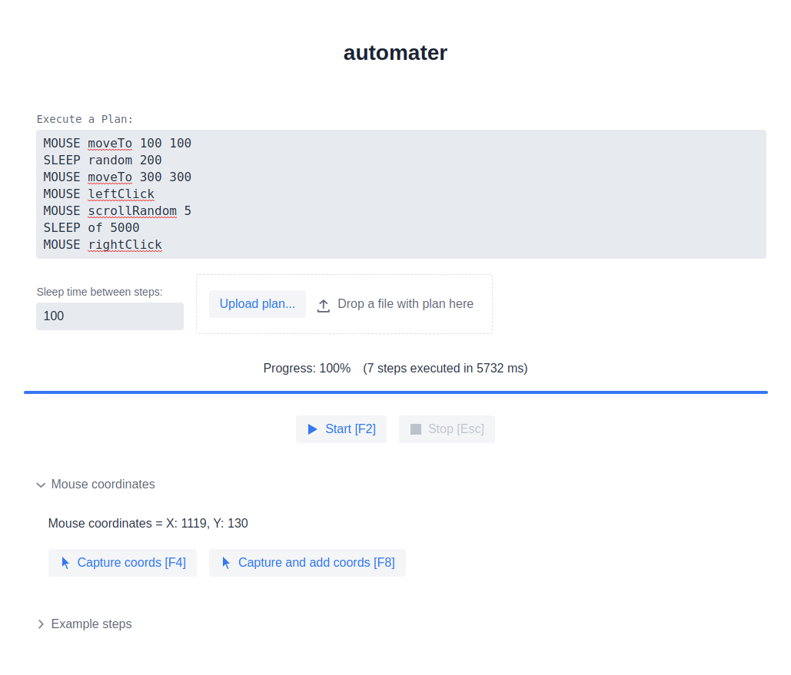

# automater

## Description

A very simple Java tool that can help you to automate manual and repetitive processes. Main features:

- can be programmed by simple commands
- can type characters and words
- can move, scroll and click mouse
- can repeat the whole execution plan and wait between steps
- can stop working after certain time
- the execution plan can be started either by UI (`http://localhost:9999`) or REST
  calls (`http://localhost:9999/start`, `http://localhost:9999/stop`)

## Screenshots

- Configuration page:
  

- Plan in progress:
  

- Capture mouse coordinates:
  

- Available steps:
  

## Requirements

- JDK 11

## Build

```shell
./gradlew build
```

## Run:

- by using Gradle and Spring Boot run task:
```shell
./gradlew bootRun
```
- ... or just by running the jar:
```shell
java -jar build/libs/automater.jar
```

Then access the configuration page to start the plan: `http://localhost:9999`

To change the default `9999` port:

```shell
./gradlew bootRun --args='--server.port=8888'
```

## Start/Stop an execution plan by a REST call:

- start:
  Execute `POST` to `http://localhost:9999/start` with a body in below format:

```json
{
  "sleepBetweenSteps": 400,
  "maxExecutionTimeSecs": 30,
  "executionLines": [
    "MOUSE moveTo 100 100",
    "SLEEP random 200",
    "MOUSE moveTo 500 500",
    "KEYBOARD press WINDOWS"
  ]
}
```

- stop:
  Execute `POST` to `http://localhost:9999/stop`.