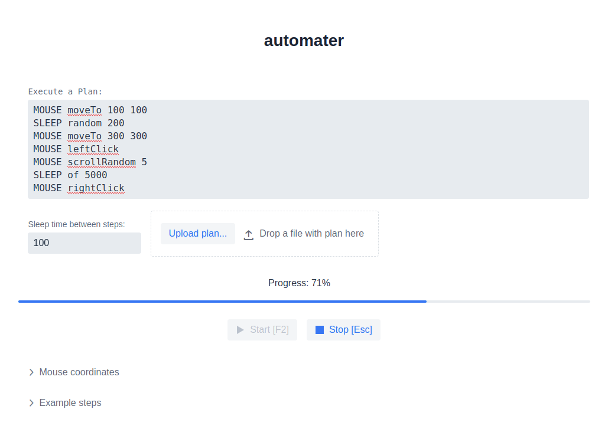

# automater

## Description

A very simple Java tool that can help you to automate manual and repetitive processes. Main features:

- can be programmed by simple commands
- can type characters and words
- can move, scroll and click mouse
- can repeat the whole execution plan and wait between steps

## Screenshots

- Configuration page:
  

- Plan in progress:
  

- Capture mouse coordinates:
  

- Available steps:
  

## Requirements

- JDK 11

## Build

```shell
./gradlew build
```

## Run:

```shell
./gradlew bootRun
```

Then access the configuration page to start the plan: `http://localhost:9999`

To change the default `9999` port:

```shell
./gradlew bootRun --args='--server.port=8888'
```
